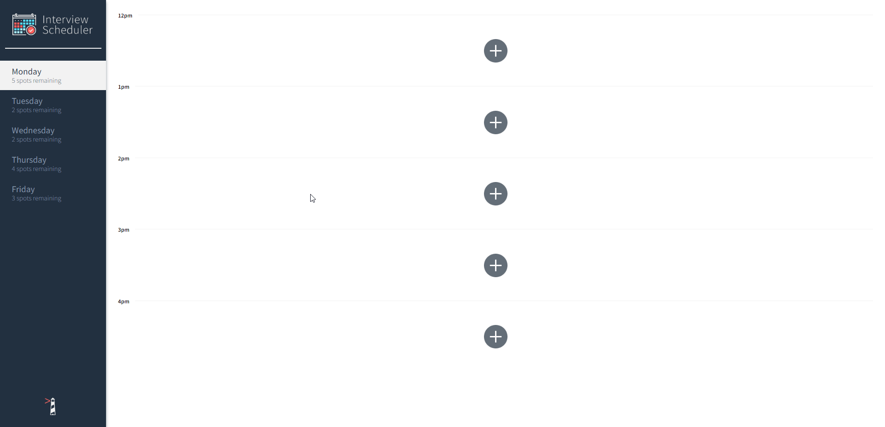
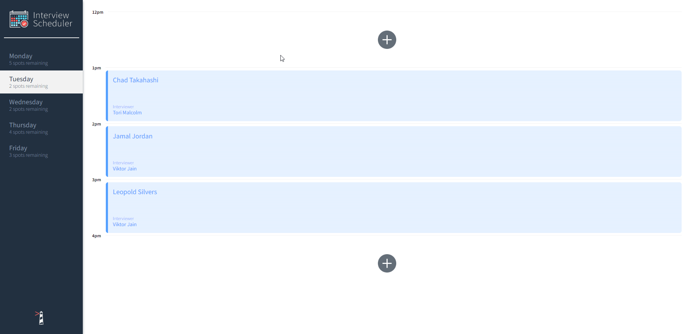
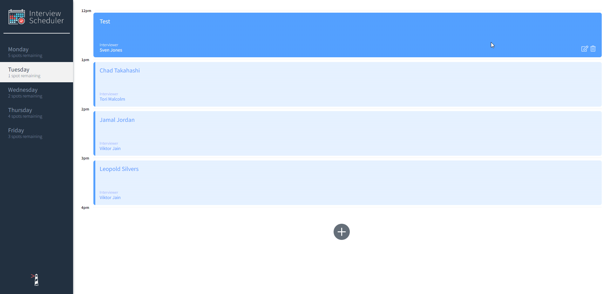
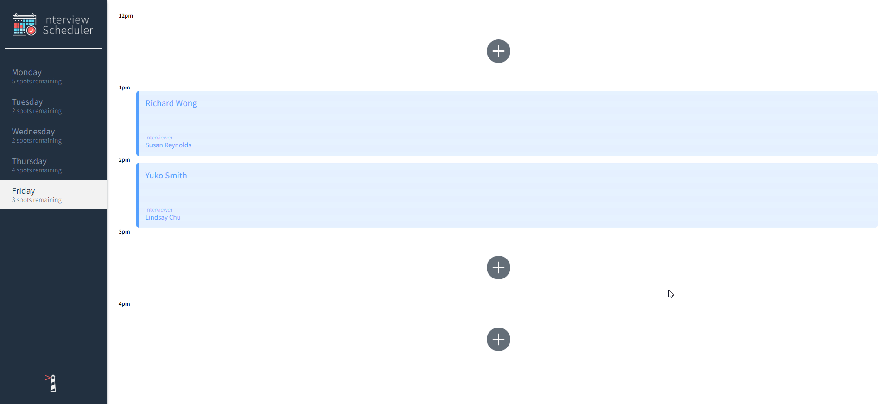

# Interview Scheduler

Interview Scheduler is an single-page React application that allows users to book appointments for students and see in real time when appointments are scheduled or canceled with Sockets. All data is stored in our Postgres server on our backend server (`scheduler-api`) so data is persistent upon reload, with a easily accessible API to work with.

## Dependencies

- React
- axios
- classnames
- Sass

## Testing Dependencies

- Storybook
- Jest
- Cypress
- react-scripts

## Getting Started

Note: You will need a Postgres Server in order to run the application.

We have to setup 2 projects we need to setup, our frontend (`scheduler`) and our backend (`scheduler-api`). We'll start by setting up the backend project first (`scheduler-api`)

1. Download or clone the project (`https://github.com/Yzma/scheduler-api`)
2. Navigate into the project directory (`scheduler-api`) and install all dependencies by running the `npm install` command in your terminal
3. Copy the `.env.example` file to `.env.development` and fill in the necessary PostgreSQL configuration. The `node-postgres` library uses these environment variables by default
4. Run the command (`npm run start`). This will start running our backend server for clients to connect to.

Note: Look inside the README file inside the (`scheduler-api`) project directory, specifically the `Creating The DB` section to learn more.

Now that we have the `scheduler-api` backend server up and running, let's switch to the frontend:

1. Download or clone the project (`git@github.com:Yzma/scheduler.git`)
2. Navigate into the project directory (`scheduler`) and install all dependencies by running the `npm install` command in your terminal
3. The default configuration is fine, but if you wish to edit the environment variables, open the `.env.development` and fill in the necessary configuration.
4. Run the command (`npm run start`). This will start running our frontend react project.
5. Once the command finishes executing, the terminal should give you a link to view in the browser, it should be (`http://localhost:8000`) by default.

At this point you should have 2 separate folders, the (`scheduler`) folder and the (`scheduler-api`) folder, both of which have their dependencies installed.

## Commands

Here are a few commands to get us up and running quickly.

### Running Webpack Development Server

```sh
npm start
```

### Running Jest Test Framework

```sh
npm test
```

### Running Cypress Test Framework

```sh
npm install -g cypress
npm run cypress
```

### Running Storybook Visual Testbed

```sh
npm run storybook
```

## Media

### Overview Page



### Booking an interview



### Canceling an interview



### Error checking interviews


